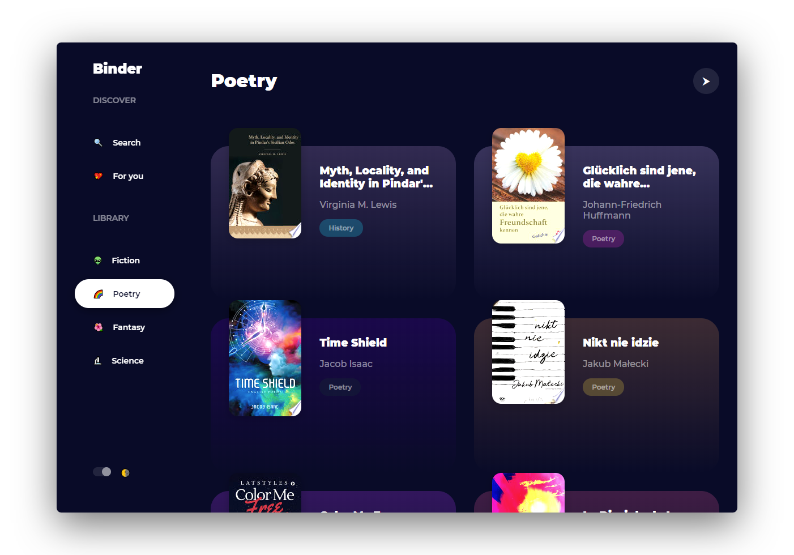

 Binder

### 📚 Find books from Google Play Books by [Warren Galyen](https://github.com/warrengalyen)

   
  
  
   

### Features :sparkles:

**Lightweight and minimal**: Crafted with minimalistic UI design

**Real-time demo**: Search books by name, author, genre etc...

**Copy color codes to the clipboard**: Click on any book to read it in Google Play Books!

**Choose custom colors**: Instant search results

 **Turn off the lights!**: Dark mode to soothe your eyes

---

## Demo

[https://warrengalyen.github.io/binder](https://warrengalyen.github.io/binder)

* Search books by name, author, genre and etc...
* Collection of curated books just for you!
* Fiction, poetry, fantasy, science and many more!
* At night, turn off the lights!

---

## Built with

* **[Chromium](https://github.com/chromium/chromium)** - Thanks for being so fast!
* HTML - For the web framework
* CSS - For styling components
* JavaScript - For magic!

---

## License

This project is licensed under the [MIT License](https://opensource.org/licenses/MIT) - see the [LICENSE](LICENSE) file for details.
